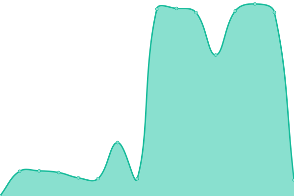

# [📈 Live Status](https://status.ixtanet.com): <!--live status--> **🟧 Partial outage**

This repository contains the open-source uptime monitor and status page for [ixtanet](https://status.ixtanet.com), powered by [Upptime](https://github.com/upptime/upptime).

With [Upptime](https://upptime.js.org), you can get your own unlimited and free uptime monitor and status page, powered entirely by a GitHub repository. We use [Issues](https://github.com/ixtanet/upptime/issues) as incident reports, [Actions](https://github.com/ixtanet/upptime/actions) as uptime monitors, and [Pages](https://status.ixtanet.com) for the status page.

<!--start: status pages-->
<!-- This summary is generated by Upptime (https://github.com/upptime/upptime) -->
<!-- Do not edit this manually, your changes will be overwritten -->
<!-- prettier-ignore -->
| URL | Status | History | Response Time | Uptime |
| --- | ------ | ------- | ------------- | ------ |
|  Ixtanet Main | 🟥 Down | [ixtanet-main.yml](https://github.com/ixtanet/upptime/commits/HEAD/history/ixtanet-main.yml) | 

 0ms
     
 | 

<a href="https://status.ixtanet.com/history/ixtanet-main">0.00%</a>
    

|  Ixtanet MServer | 🟩 Up | [ixtanet-m-server.yml](https://github.com/ixtanet/upptime/commits/HEAD/history/ixtanet-m-server.yml) | 

 116ms
     
 | 

<a href="https://status.ixtanet.com/history/ixtanet-m-server">100.00%</a>
    

|  Purificadora Ixtatan | 🟩 Up | [purificadora-ixtatan.yml](https://github.com/ixtanet/upptime/commits/HEAD/history/purificadora-ixtatan.yml) | 

 4199ms
     
 | 

<a href="https://status.ixtanet.com/history/purificadora-ixtatan">82.81%</a>
    

|  POS Ixtanet | 🟩 Up | [pos-ixtanet.yml](https://github.com/ixtanet/upptime/commits/HEAD/history/pos-ixtanet.yml) | 

 1811ms
     
 | 

<a href="https://status.ixtanet.com/history/pos-ixtanet">82.82%</a>
    

|  MANAGER ISP.GT | 🟩 Up | [manager-isp-gt.yml](https://github.com/ixtanet/upptime/commits/HEAD/history/manager-isp-gt.yml) | 

 1360ms
     
 | 

<a href="https://status.ixtanet.com/history/manager-isp-gt">82.82%</a>
    

|  Ixtanet SAT | 🟥 Down | [ixtanet-sat.yml](https://github.com/ixtanet/upptime/commits/HEAD/history/ixtanet-sat.yml) | 

 51ms
     
 | 

<a href="https://status.ixtanet.com/history/ixtanet-sat">0.00%</a>
    

|  N IXTANET | 🟩 Up | [n-ixtanet.yml](https://github.com/ixtanet/upptime/commits/HEAD/history/n-ixtanet.yml) | 

 136ms
     
 | 

<a href="https://status.ixtanet.com/history/n-ixtanet">97.15%</a>
    

<!--end: status pages-->

[**Visit our status website →**](https://status.ixtanet.com)

## 📄 License

- Powered by: [Upptime](https://github.com/upptime/upptime)
- Code: [MIT](./LICENSE) © [ixtanet](https://status.ixtanet.com)
- Data in the `./history` directory: [Open Database License](https://opendatacommons.org/licenses/odbl/1-0/)
